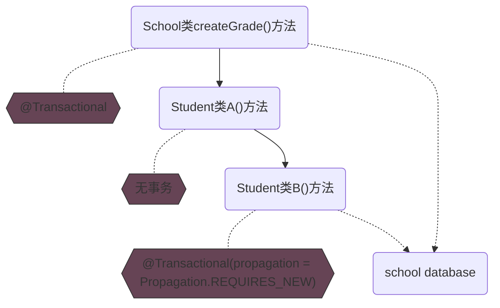

# @Transactional

<big>*It is*</big>->Spring事务组件提供的事务处理通用支持注解，通过AOP实现事务处理。

- 在 Spring 事务处理 中，可以通过设计****一个 TransactionProxyFactoryBean 来使用 AOP 功能，通过这个
  TransactionProxyFactoryBean 可以生成 Proxy
  代理对象，在这个代理对象中，通过 TransactionInterceptor 来完成对代理方法的拦截，正是这些 AOP 的拦截功能，将事务处理的功能编织进来。
  ```mermaid
  graph LR;
  A["TransactionProxyFactoryBean"] -->|"生成"| B(("Proxy代理对象"));
  B -->|"在代理对象中"| C["TransactionInterceptor拦截代理方法"];
  ```
- Spring事务处理适配的具体事务处理器:
  ```mermaid
  graph TD
  A("支持数据源") --> B("DataSource")
  A --> C("Hibernate")
  A --> D("JDO")
  A --> E("JPA and JTA")
  ```
- 事务的创建：
  ```java
  // from TransactionAspectSupport.java
  // in method TransactionInterceptor#invoke()->TransactionAspectSupport#invokeWithinTransaction()
    @SuppressWarnings("serial")
    protected TransactionInfo createTransactionIfNecessary(@Nullable PlatformTransactionManager tm,
    		@Nullable TransactionAttribute txAttr, final String joinpointIdentification) {

    	// If no name specified, apply method identification as transaction name.
    	if (txAttr != null && txAttr.getName() == null) {
    		txAttr = new DelegatingTransactionAttribute(txAttr) {
    			@Override
    			public String getName() {
    				return joinpointIdentification;
    			}
    		};
    	}
        // TransactionStatus封装了事务执行的状态信息
    	TransactionStatus status = null;
    	if (txAttr != null) {
    		if (tm != null) {
                // 根据定义好的事务方法配置信息TransactionAttribute，通过
                // 平台事务管理器 PlatformTransactionManager 创建事务，同时返回
                // TransactionStatus 来记录当前的事务状态，包括已经创建的事务
    			status = tm.getTransaction(txAttr);
    		}
    		else {
    			if (logger.isDebugEnabled()) {
    				logger.debug("Skipping transactional joinpoint [" + joinpointIdentification +
    						"] because no transaction manager has been configured");
    			}
    		}
    	}
        // 准备 TransactionInfo, TransactionInfo对象，封装了事务处理的配置信息以及TransactionStatus
    	return prepareTransactionInfo(tm, txAttr, joinpointIdentification, status);
    }
  ```

。。。

## 一个相关的死锁Bug记录

代码抽象：

```java
public class School {
    private Student student = new Student();

    @Transactional
    public T createGrade() {
      ...
        for (; ; ) {
            student.A();
        }
      ...
        operate school database; 
      ...
    }
}

public class Student {
    public T A() {
      ...
        B();
      ...
    }

    @Transactional(propagation = Propagation.REQUIRES_NEW)
    public T B() {
      ...
        operate school database;
      ...
    }
}
```

操作抽象：



**推测原因**：

- 底层->Spring采用动态代理（AOP）实现对bean的管理和切片，它为每个class都会生成一个代理对象。**
  只有在代理对象之间调用时，才可以触发切面逻辑。**

而同一个class中，方法A调用方法B，且方法A无事务时，调用的是*原对象*
的方法，而不是通过代理对象，因此Spring无法切换到这次调用，也就无法通过注解保证事务性了。（不同类的方法互相调用则无此坑）

- 谜底揭晓->createGrade()
  中已经存在一个对school数据表的操作，锁表之后调用无事务的A，由于上述原理，被A调用的B实际上也是无事务，B又包含一个对同表的操作，然而createGrade()
  事务持续中，遂死锁……

- 处理方案：在A方法上添加@Transactional(propagation = Propagation.REQUIRES_NEW)，B方法改为@Transactional
## Tip
- propagation =
Propagation.REQUIRES_NEW（从字面即可知道，new，每次都要一个新事务，该传播级别的特点是，每次都会新建一个事务，并且**
同时将上下文中的事务挂起**，执行当前新建事务完成以后，上下文事务恢复再执行。（总是开启一个新的事务。如果一个事务已经存在，则将这个存在的事务挂起。））

- Jpa不支持PROPAGATION_NESTED模式