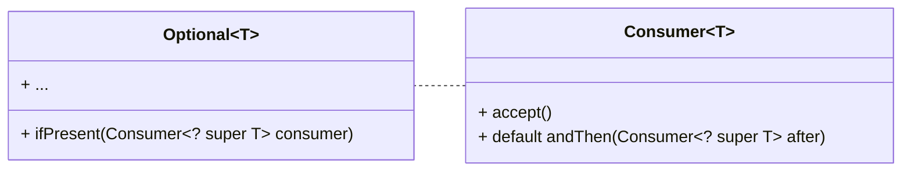
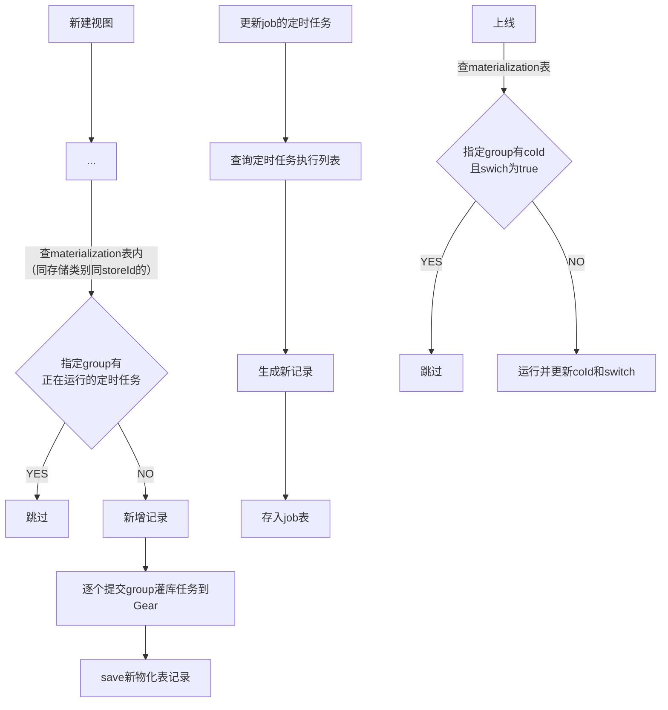

# @FunctionalInterface

- An **informative** annotation type used to indicate that an interface type declaration is intended to be a functional
  interface as defined by the Java Language Specification.
- **Conceptually, a functional interface has exactly one abstract method**（不含default methods
  和override了Object类public方法的抽象方法）.

- 标识**功能接口**-->将方法作为参数使用。
- 遗漏了只会导致理解问题
- eg.Comparable ， Runnable ， EventListener ， Comparator等
- 应用实例：



```java

@FunctionalInterface
public interface Consumer<T> {

    /**
     * Performs this operation on the given argument.
     *
     * @param t the input argument
     */
    void accept(T t);

    /**
     * Returns a composed {@code Consumer} that performs, in sequence, this
     * operation followed by the {@code after} operation. If performing either
     * operation throws an exception, it is relayed to the caller of the
     * composed operation.  If performing this operation throws an exception,
     * the {@code after} operation will not be performed.
     *
     * @param after the operation to perform after this operation
     * @return a composed {@code Consumer} that performs in sequence this
     * operation followed by the {@code after} operation
     * @throws NullPointerException if {@code after} is null
     */
    default Consumer<T> andThen(Consumer<? super T> after) {
        Objects.requireNonNull(after);
        return (T t) -> {
            accept(t);
            after.accept(t);
        };
    }
}
```

```java
public void ifPresent(Consumer<? super T>consumer){
        if(value!=null)
        consumer.accept(value);
        }
```


