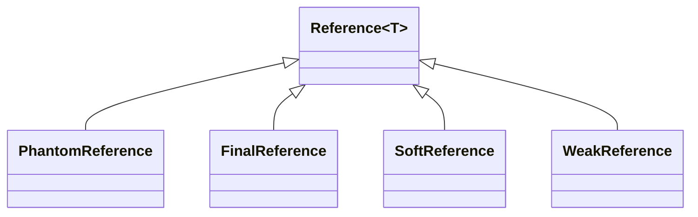

# Reference

## StrongReference

- new对象时默认是强引用，强引用不会被垃圾回收器回收（内存空间不足则触发OOM）
- 可以*弱化*不再使用的强引用对象以帮助GC回收，即设置对象为null；
- 在一个方法内部有一个强引用，该引用保存在Java栈中,引用内容则在Java堆上，当这个方法运行完成后退出方法栈，引用对象的引用数为0，对象将会被回收。

## SoftReference

- 软引用的回收与剩余内存空间有关，内存空间不足时，软引用的对象就会被回收(先置为null，然后通知gc)。
- 软引用可以用来实现*内存敏感*的高速缓存/浏览页面历史
- 软引用可以与一个ReferenceQueue联合使用，若软引用的引用对象被垃圾回收，java虚拟机就会把软引用入队

## WeakReference

- GC每次扫描必标记弱引用并通知回收。
- 用WeakReference的对象方法get()将弱引用转化为强引用。
- 同样可以与引用队列联合使用。

## PhantomReference
- 和没有引用一样，不影响GC回收
- 用来跟踪对象被GC回收的活动
- 必须（不是可选）与引用队列一起使用，GC回收虚引用对象前会把虚引用加入引用队列中